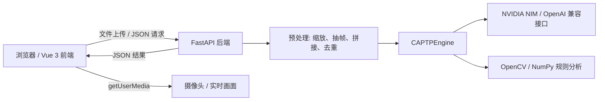

# CAPTP 系统概述与需求说明（当前实现版）

## 1. 项目定位
CAPTP 是一个面向警务实战训练的 AI 评估与推演平台。本仓库当前已经演进为前后端分离形态，主线实现是：

- 前端：`frontend/` 下的 Vue 3 单页控制台
- 后端：`backend/` 下的 FastAPI 识别服务
- AI 能力：通过 NVIDIA NIM 的 OpenAI 兼容接口完成视觉分析与战术推演

仓库根目录还保留了一套早期的 `Streamlit` 原型（`app.py`、根目录 `ai_engine.py`），它更像是历史演示入口，不是当前主线。

## 2. 当前实现范围
当前代码真正覆盖的能力主要有四类：

1. 射击评估
   - 姿态纠偏分析
   - 靶纸评分分析
   - 武器负载识别

2. 格斗评估
   - 暴力识别
   - 对抗评分

3. 战术推演
   - 场景化问答
   - 轮次化追问
   - 场景切换

4. 实时采集
   - 浏览器摄像头接入
   - 实时画面抓拍
   - 连续识别

当前代码中没有真正落地的内容包括：

- 后端账号体系和权限系统
- 数据库持久化
- Redis、Celery、消息队列
- 报告导出服务
- WebSocket 推送
- 真正的审计、监控、告警链路

前端登录页目前只是本地演示门禁，并没有对接后端鉴权。

## 3. 技术栈

| 层级 | 技术 | 说明 |
|---|---|---|
| 前端框架 | Vue 3 | 组合式 API，单页应用 |
| 构建工具 | Vite | 本地开发与生产构建 |
| 前端能力 | 浏览器 `MediaDevices`、`fetch` | 摄像头接入与 API 调用 |
| 样式 | 自定义 CSS | 主要样式直接写在组件和全局样式中 |
| 后端框架 | FastAPI | 提供识别与推演接口 |
| Python 运行时 | Python 3.11 | 后端主运行环境 |
| 图像处理 | OpenCV、NumPy | 视频抽帧、缩放、评分、靶纸识别 |
| 模型接入 | OpenAI SDK + NVIDIA NIM | 兼容 OpenAI 风格调用 |
| 容器化 | Docker、Nginx | 前端静态站点和后端服务容器化 |

补充说明：

- 当前前端没有引入 Vue Router
- 当前前端没有引入 Pinia
- 当前前端没有引入第三方 UI 组件库
- `frontend/src/utils/api.js` 支持通过 `VITE_API_BASE_URL` 覆盖后端地址

## 4. 代码结构

- `frontend/src/App.vue`
  - 顶层壳页面
  - 控制登录态与页面切换
- `frontend/src/components/Login.vue`
  - 本地登录门禁
  - 默认账号逻辑为演示用
- `frontend/src/components/Overview.vue`
  - 平台总览页
  - 展示运营指标和首页视觉区
- `frontend/src/components/Shooting.vue`
  - 射击评估页
  - 支持上传图片、上传视频、实时摄像头
- `frontend/src/components/Grappling.vue`
  - 格斗评分页
  - 支持上传图片、上传视频、实时摄像头
- `frontend/src/components/Tactical.vue`
  - 战术推演页
  - 场景切换 + 对话式推演
- `frontend/src/composables/useLiveCameraSource.js`
  - 摄像头枚举、切换、开启、关闭
  - 实时抓拍、最佳帧选择、多帧拼接
- `frontend/src/utils/api.js`
  - API 地址封装
  - 响应体解析
- `frontend/src/data/tacticalScenarios.js`
  - 战术场景数据源
- `backend/main.py`
  - FastAPI 路由
  - 图片/视频预处理
  - 请求分发
- `backend/ai_engine.py`
  - NVIDIA NIM 调用封装
  - OpenCV 规则分析
  - 实时会话逻辑
- `backend/config.py`
  - 模型名与接口配置
- `run_all.bat`
  - 本地一键启动前后端
- `docker-compose.yml`
  - 容器化部署编排

## 5. 系统架构



## 6. 前端页面

### 6.1 登录页

- 进入系统前的本地门禁
- 使用固定账号 `admin / 123456` 进行演示
- 仅控制页面显示状态，不参与后端鉴权

### 6.2 总览页

- 展示终端状态、累计评估量、AI 偏差指标等首页数据
- 属于展示型页面，不直接发起分析请求

### 6.3 射击评估页

- 支持两种数据源
  - 本地图片上传
  - 实时摄像头画面
- 支持三种模式
  - 姿态纠偏分析
  - 靶纸评分分析
  - 武器负载识别
- 实时模式下，前端会连续采样并选择更清晰的画面再提交给后端
- 结果区直接展示后端返回的评估文本

### 6.4 格斗评分页

- 支持两种数据源
  - 本地图片或视频
  - 实时摄像头画面
- 支持两种模式
  - 暴力识别
  - 对抗评分
- 实时模式下会抓取多帧并拼成 contact sheet，再提交给后端

### 6.5 战术推演页

- 提供四个预置场景
  - 人质劫持危机处理
  - 群体性突发事件疏导
  - 入室搜捕战术接战
  - 常规道路拦截盘查
- 采用聊天式交互
- 前端会保留最近消息，并把场景简报一并发送给后端
- 每轮回复后，后端会继续给出下一步追问

## 7. 后端接口

### 7.1 `POST /api/analyze-vision`

请求方式：`multipart/form-data`

| 字段 | 类型 | 说明 |
|---|---|---|
| `file` | File | 必填，图片或视频文件 |
| `mode` | String | 可选，默认 `SHOOTING_POSTURE` |
| `source` | String | 可选，默认 `upload`，可取 `upload` / `live` |
| `session_id` | String | 可选，实时模式下用于会话缓存 |

当前支持的模式值：

- `SHOOTING_POSTURE`
- `SHOOTING_TARGET`
- `SHOOTING_WEAPON`
- `COMBAT_FIGHT`
- `COMBAT_SCORING`

接口行为：

- 自动识别图片或视频
- 视频会先抽帧，再交给模型或规则分析
- 根据不同模式分流到不同分析逻辑
- 成功时返回 `{ "result": "..." }`

### 7.2 `POST /api/tactical-chat`

请求方式：`application/json`

```json
{
  "messages": [
    { "role": "system", "content": "..." },
    { "role": "user", "content": "..." }
  ],
  "scenario": "人质劫持危机处理",
  "scenarioContext": "..."
}
```

接口行为：

- 压缩近期上下文
- 注入场景上下文
- 调用战术模型生成推演回复
- 按场景强制补充下一问

### 7.3 `GET /api/health`

- 健康检查接口
- 返回 `{"status":"ok"}`

## 8. 识别与推演流程

### 8.1 图像预处理

- 普通模式下，后端会将图片缩放到较合理的长边尺寸并重新编码为 JPEG
- 靶纸模式会保留更高的分辨率，以便 OpenCV 规则识别更稳

### 8.2 视频预处理

- 后端支持常见视频格式
  - `.mp4`
  - `.mov`
  - `.avi`
  - `.mkv`
  - `.webm`
- 视频会临时落盘，再通过 `cv2.VideoCapture` 读取
- 抽帧点固定在 18%、42%、66%、84% 附近
- 格斗模式会把多帧拼成 2x2 拼图
- 其他模式会挑选清晰度最高的一帧进行识别

### 8.3 射击靶纸识别

- `SHOOTING_TARGET` 优先走 OpenCV 规则识别
- 系统会估算靶纸、弹孔数量、环数分布、偏移趋势和整体水平
- 如果规则识别失败，再回退到视觉模型

### 8.4 实时识别

- 实时模式依赖浏览器摄像头
- 前端会主动抓取最佳帧或连续帧拼图
- 后端用 `session_id` 做短期内存会话缓存
- 相似帧会直接复用结果，减少重复推理
- 对模糊、曝光不足的画面会附带质量提示

### 8.5 格斗评分

- `COMBAT_FIGHT` 和 `COMBAT_SCORING` 走视觉模型分析
- 输出是中文结构化评估
- 重点关注双方动作、可能伤害、控制态势和改进建议

### 8.6 战术推演

- 采用最近消息压缩 + 场景注入的方式生成回复
- 角色是“警务教官 / 场景推演引擎”
- 每轮都尽量给出明确的下一步追问

## 9. 运行方式

### 9.1 本地开发

后端：

```bash
cd backend
uvicorn main:app --reload --host 127.0.0.1 --port 8000
```

前端：

```bash
cd frontend
npm install
npm run dev -- --host 127.0.0.1 --port 5173
```

也可以直接执行根目录的 `run_all.bat`，它会同时启动前端和后端。

如果后端不是本机地址，需要在前端通过 `VITE_API_BASE_URL` 指向正确的 API 地址。

### 9.2 Docker 部署

- 后端镜像由 `backend/Dockerfile` 构建
- 前端镜像由 `frontend/Dockerfile` 构建
- `frontend/Dockerfile` 采用多阶段构建，最终用 Nginx 提供静态站点
- `docker-compose.yml` 中已经给出前后端的服务编排和端口映射

## 10. 当前边界

当前代码仍属于“可演示、可评估、可推演”的实现阶段，离完整产品还有一些差距：

- 没有真正的用户体系
- 没有数据库持久化
- 没有任务队列
- 没有报表导出接口
- 没有 WebSocket 实时推送
- 没有后台审计与监控面板

另外，`backend/ai_engine.py` 里还保留了法务/警务文档解析这类内部方法，但 `backend/main.py` 暂时没有给它开放公开路由。

## 11. 后续可扩展方向

- 把登录态接到真正的后端认证
- 给分析结果加数据库落库
- 增加异步任务队列和结果回调
- 补充报表导出
- 增加 WebSocket 推送
- 把模型配置和密钥全部迁移到环境变量或密钥管理系统

## 12. 小结

这份文档对应的是当前仓库“真实在跑的实现”：

- 前端是一个自定义风格的 Vue 控制台
- 后端是一个 FastAPI 识别服务
- AI 推理主要通过 NVIDIA NIM 完成
- 目前最核心的能力是射击评估、格斗评分和战术推演

如果后续代码继续演进，建议以 `backend/main.py`、`backend/ai_engine.py` 和 `frontend/src/` 作为更新文档的第一依据。
